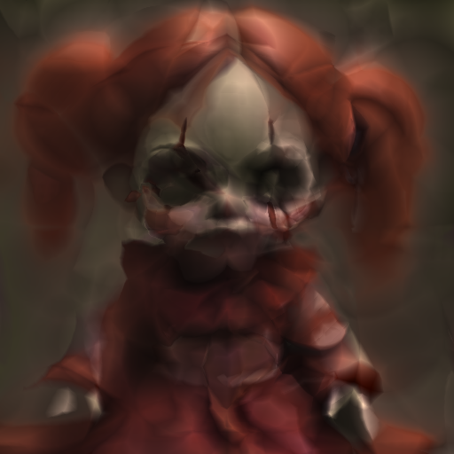
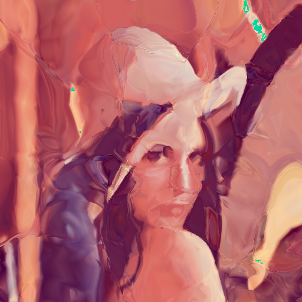
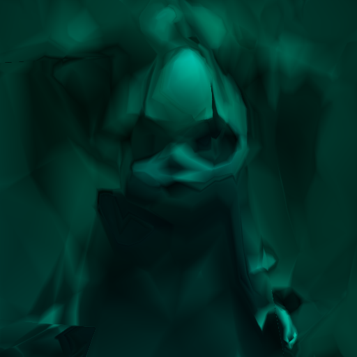
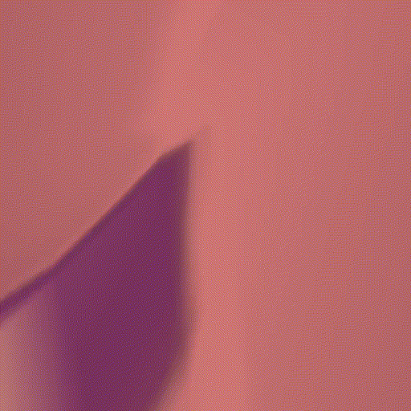

# Salutations! 🧠 📸🖼️


Everyone likes AI/ML/GLSL so let's have an AI/ML/GLSL party up in here! 🎉🥳🎊🎁

I'm using 3.10.10 with pyenv. You should find all goodies in requirements.txt

See it in action on [shadertoy#w3l3W4](https://www.shadertoy.com/view/w3l3W4), the loss there was under .004.
And took about an hour to train.

# Training Examples 🏋️‍♂️

| ⛩️       | Final                         | Training                      | Stats                                |
|----------|-------------------------------|-------------------------------|--------------------------------------|
| E16      |  |  | loss:.000383, new endocing, long run |
| Encoding |  |  | loss:.003700, encoding:3, 60m, ckp   |
| Raw      |  |  | loss:.006588, encoding:0, 10m        |

The "E16" encoding using a 2d -> 16d enociding 

In terms of generated code, using a 16 layer wide model with 4 layers seems to be the sweet spot...

## Further Experiments

Here are some things I've tried or want to try or have failed to try:

1.  better image pre-processing (x)
2.  varying the test inputs (/)
3.  changing around the loss function (/)
4.  tweaks to the training method  (/)
5.  try it on different images (/)
6.  add ability t reload weights from a prior run (/)
7.  train the encoder instead of having a static method
8.  modify the model architecture (attention?)
9.  try smaller models (/)
10. conditioning (?)
11. more optimized generated code (/)

# Train the model 🏋🏽🔥💪🏼🎧

All you need is the input image. Here is an example specifying some output files as well

```
time ./futuristica.py --weights lenna.npz --generated output.png --training 30 --coding 2 --image lenna.png 
```

On my rtx 3060, training for 30 (x 5000) epochs takes about 30 minutes.

You can also try `--ckp futuristica.npz` to start from a trained model

I strongly recommend using `run-training.sh` to keep thing organized, see below.

## Stuck Training 😩😮‍💨

If you start to see a line like this: `Epoch 265161: PUNT: 5001 is too long!`, then training is probably stuck. 
You'll either need to tweak the model or the code or just reroll and hope the RNG loves you better.

During training it will probably drop png's and weights.npz files so you should be ok to kill it but find the
weights file first!

# Generate GLSL for ShaderToy 🌗🧸🧩🚂

This will dump a big bunch spew: `./translate.py lenna.npz` 

Note: the `run-training.sh` will take care of this for you.

# Tweak the model 🛠️🧠💡🤓🤔💪🏻

Edit futuristica.py and change the definition of layers in the MLP class at the top.

# Helper Scripts 🤝🤗🛟🚢🆘🛟🚨📢

The script `run-training.sh` helps save output from training runs into
a directory for each run.  It's there to help keep things organized.

Each training will have it's output in a timestamped directory under
./run, just trying running it... Some info bits might not work until
you deal with the dependencies, but training should still work.

Note: it will also create a symbolic link from the main directory to
the latest training run for convenience / laziness.

Note: futuristica.py now has matlib integration to show realtime plot and most recent image,
so you may not see much use in the helpers.

You can use TrainSpotting.py but it can be buggy cuz tk is buggy.

The script `historic-output.sh` will 
- look at the output png's from training
- display the latest one
- create an mp4 of all of them
- display the mp4 as a time lapse
I wrote it cuz it's nifty.

## Script Dependencies 🔗⚓

To run the support scripts you'll need some tools installed or to edit them to use your preffered

I use an ancient, crusty program called "xv" which you can replace with any thing else that can display a png.

The `historic-output.sh` script has a bit more odds and ends in addition to "xv":
- ffmpeg, to create an mp4 from the training output videos
- mplayer to display the mp4

# Further Reading

https://medium.com/deepfail/implementing-jpeg-compression-in-pytorch-b0a830889f59
https://pytorch.org/tutorials/intermediate/transformer_building_blocks.html
https://www.geeksforgeeks.org/pytorch-loss-functions/
