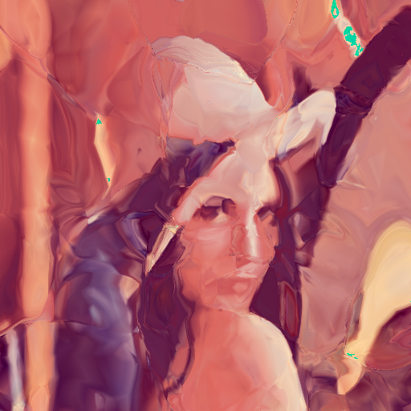
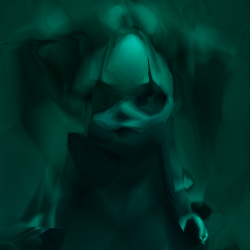
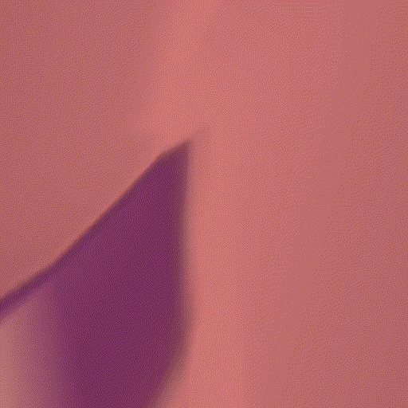

# Futuristica

Train a tiny SIREN neural network to represent an image, then export it as GLSL
for [ShaderToy](https://www.shadertoy.com/view/sflXWr).  
AI/ML/GLSL party up in here.
Older [ShaderToy version](https://www.shadertoy.com/view/w3l3W4). 


## Quick start

```bash
pip install -r requirements.txt
bin/run-training images/lenna.png
```

Output lands in `run/training-TIMESTAMP/`. The latest run is symlinked as `last/`.

## Training examples

| Run      | Final                         | Training                      | Stats                          |
|----------|-------------------------------|-------------------------------|--------------------------------|
| Siren    |  |  | loss 0.000669, 40h, 8x16       |
| E16      |  |  | loss 0.000383, long run        |
| Encoding |  |  | loss 0.003700, 60m, ckp        |
| Raw      |  |  | loss 0.006588, encoding:0, 10m |

## Layout

```
bin/              executables — futuristica, translate, trainspotting, run-*
lib/              Python classes (one per file) + based.sh
etc/              local.conf.example — copy to local.conf at repo root to configure
dox/              notes, experiments, architecture
images/           sample training images
```

## Binaries

| Command                    | What it does                                      |
|----------------------------|---------------------------------------------------|
| `bin/futuristica`          | Train the model                                   |
| `bin/translate`            | Export weights → GLSL for ShaderToy               |
| `bin/run-training`         | Organised training run (timestamped output dir)   |
| `bin/run-grid`             | Parameter sweep across loss/colorspace/mapping    |
| `bin/meta-train`           | Reptile meta-learner — build a warm-start init    |
| `bin/run-meta-train-grid`  | Generate checkpoint grid for common config combos |
| `bin/trainspotting`        | GUI image viewer for watching training (needs X11)|
| `bin/historic-output`      | Build and play a timelapse mp4 of a run           |

## Direct usage

```bash
# train
bin/futuristica --image images/lenna.png --training 30 --weights lenna.npz --no_gui

# export GLSL
bin/translate lenna.npz

# parameter sweep
bin/run-grid images/lenna.png
```

## Local config

Copy `etc/local.conf.example` to `local.conf` at the repo root to set output
directories and per-session training knobs without touching the scripts:

```bash
cp etc/local.conf.example local.conf
```

See `dox/notes.md` for experiments, architecture notes, meta-training results, and SSH/headless tips.
